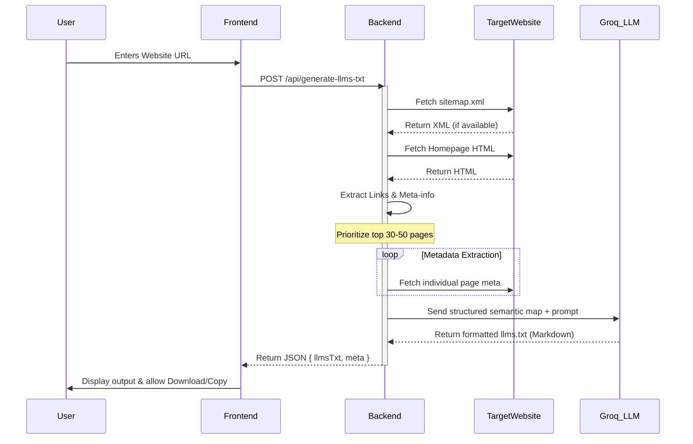

# V1 LLMs.txt Generator: System Overview

## 1. Executive Summary
The **LLMs.txt Generator** is a tool designed to help website owners optimize their content for the next generation of AI search engines and Large Language Model (LLM) crawlers. It automates the creation of an `llms.txt` file (based on the [llmstxt.org](https://llmstxt.org) specification), which acts as a "sitemap for AI," providing structured, high-value information that is easy for LLMs to ingest and process.

### Why this matters (GEO Alignment)
Traditional SEO (Search Engine Optimization) focuses on ranking in Google. **GEO (Generative Engine Optimization)** focuses on being accurately cited and used by AI models like ChatGPT, Claude, and Perplexity. This tool bridges that gap.

---

## 2. Technical Architecture & Tech Stack

The system follows a clean **Client-Server architecture** built with modern JavaScript tools.

### Tech Stack
*   **Backend**: Node.js with [Express.js](https://expressjs.com/)
*   **Frontend**: Vanilla HTML5, CSS3 (Custom Design System), and JavaScript.
*   **LLM Integration**: [Groq SDK](https://github.com/groq/groq-node) (using `gpt-oss-120b` or similar high-performance models).
*   **Crawling Engine**: Dual-mode — lightweight `https`/`http` with automatic fallback to [Playwright](https://playwright.dev/) (Chromium) for JavaScript-heavy sites.
*   **Rate Limiting**: [Bottleneck](https://github.com/SGrondin/bottleneck) for request throttling with token-bucket algorithm.
*   **Proxy Rotation**: Built-in `ProxyPool` class supporting round-robin IP rotation with failure tracking.

### System Components
1.  **Frontend (UI)**: A single-page professional interface where users input their URL, configure crawl depth/options, and monitor the multi-step generation process.
2.  **Smart Crawler**: A dual-mode backend service — uses lightweight `safeFetch` by default, automatically escalating to Playwright (headless Chromium) when SPA/React content is detected.
3.  **Rate Limiter & Proxy Pool**: Bottleneck-powered request throttling with configurable concurrency, burst limits, and optional IP rotation via a comma-separated proxy list.
4.  **Deep Crawl Engine**: BFS-based multi-level crawler (up to 5 levels deep) with path allow/block lists and configurable page limits.
5.  **Prioritization Engine**: A logic layer that filters and ranks discovered pages based on importance (e.g., pricing, docs, and features are prioritized over tags or authors).
6.  **Metadata Extractor**: Fetches titles and meta-descriptions for the top 30-50 pages.
7.  **LLM Generator**: Feeds the raw semantic map into an LLM to produce a categorized, well-formatted markdown file following the official spec.

---

## 3. Data Flow (End-to-End)

The following diagram illustrates how data moves from user input to the final `.txt` artifact:

---

## 4. Operational Status: Real or Mock?

The tool is **fully functional** but currently operates in a "Beta/Base" mode:

*   **Logic**: The crawling, metadata extraction, and LLM prompting logic are all **real**.
*   **Live Backend**: The server is a real Node.js environment capable of making outbound requests.
*   **Fallback Mechanism**: If the `GROQ_API_KEY` is missing, the tool switches to a **Rule-based Fallback**. It will still generate an `llms.txt` file using internal logic, but the categorization and summaries will be less sophisticated than the AI-powered version.

---

## 5. Productization Roadmap (Required Improvements)

To transform this from a V1 tool into a production-grade SaaS product, the following implementations are required:

### Technical Enhancements
1.  ~~**Distributed Crawling**~~: ✅ **DONE** — Playwright (Chromium) auto-fallback for SPA/React/JS-heavy sites. Smart heuristic detection in `lib/browserRenderer.js`.
2.  ~~**Rate Limiting & Proxying**~~: ✅ **DONE** — Bottleneck throttling + `ProxyPool` with round-robin rotation and failure tracking in `lib/rateLimiter.js`. Configurable via `CRAWL_CONCURRENCY`, `CRAWL_MIN_DELAY_MS`, and `PROXY_LIST` env vars.
3.  **Caching Layer**: Use Redis to cache results for specific domains to reduce LLM costs and improve performance for repeat requests.
4.  ~~**Deep Crawl Options**~~: ✅ **DONE** — BFS deep crawler up to 5 levels with path filtering in `lib/deepCrawler.js`. Exposed in UI via Advanced Options panel.

### User Experience (UX)
1.  **Customization Interface**: Allow users to manually "check/uncheck" pages before the LLM generates the final file.
2.  **Live Preview**: A split-screen view where changes to the source site (or metadata) are reflected in real-time in the `llms.txt` output.
3.  **One-Click Deployment**: Integrations with Vercel, Netlify, or AWS to automatically upload the generated file to the site's root directory.

### Business/Security
1.  **Authentication**: User accounts and API token management.
2.  **Security Auditing**: Ensure the "Permissive HTTPS Agent" used in dev is replaced with a secure validation layer for production.

---

## 6. Detailed End-to-End Flow (Summary)

1.  **Input**: User provides a URL (e.g., `https://maximuslabs.com`).
2.  **Discovery**: System checks for `sitemap.xml` and the homepage to find as many internal links as possible.
3.  **Analysis**: The top 30-50 most "important" pages are selected based on their path structure.
4.  **Enrichment**: The system visits those pages to get their true `<title>` and `<meta description>`.
5.  **Intelli-Format**: This structured data is sent to a high-context LLM with strict formatting rules.
6.  **Output**: A clean, spec-compliant `llms.txt` file is presented to the user for immediate use.
